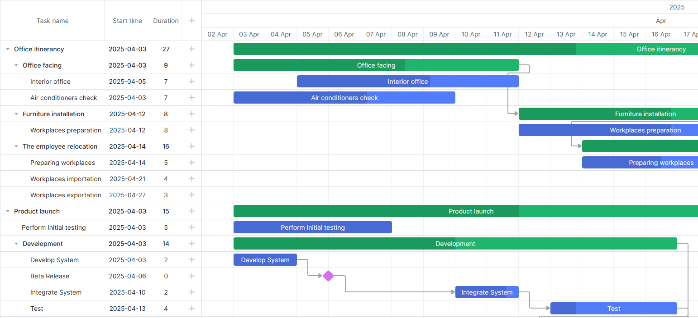

# Angular Gantt Quick-Start

[](https://dhtmlx.com/)

> Starter project showing how to use [DHTMLX Angular Gantt](https://dhtmlx.com/docs/products/dhtmlxGantt-for-Angular/) in an Angular App.

**Related tutorial**:
[https://docs.dhtmlx.com/gantt/integrations/angular/quick-start/](https://docs.dhtmlx.com/gantt/integrations/angular/quick-start/)




## How to start

### Online

[](https://codespaces.new/DHTMLX/angular-gantt-quick-start/)

### On the local host

Clone the repo and run

```bash
git clone https://github.com/dhtmlx/angular-gantt-quick-start.git
cd angular-gantt-quick-start
npm install
npm start
```

## Code example

The component allows simple declarative initialization:

```typescript
import { Component } from '@angular/core';
import {
  DhxGanttComponent,
  type AngularGanttDataConfig,
} from '@dhtmlx/trial-angular-gantt';

import { links, tasks } from './demo-data';

@Component({
  selector: 'app-gantt-chart',
  standalone: true,
  imports: [DhxGanttComponent],
  host: { style: 'display:block;height:100%;' },
  template: `
    <dhx-gantt
      style="display:block;height:100%;"
      [tasks]="tasks"
      [links]="links"
      [config]="config"
      [data]="dataConfig">
    </dhx-gantt>
  `,
})
export class GanttChartComponent {
  tasks = tasks;
  links = links;

  config = {
    date_format: '%Y-%m-%d %H:%i',
    columns: [
      { name: 'text', tree: true, width: '*' },
      { name: 'start_date', label: 'Start', align: 'center' },
      { name: 'duration', label: 'Duration', align: 'center' },
      { name: 'add', width: 44 },
    ],
  };

  dataConfig: AngularGanttDataConfig = {
    save: (entity, action, item, id) => {
      console.log('save', { entity, action, item, id });
    },
  };
}
```

Check the [Online documentation](https://docs.dhtmlx.com/gantt/integrations/angular/) to find more.

## Project structure

```
src/
  app/
    gantt-chart.component.ts  <- <app-gantt-chart> component
    demo-data.ts              <- minimal task/link arrays
    app.ts                    <- mounts GanttChartComponent
    app.config.ts
  styles.css
  index.html
```

## Want full-featured examples?

[Start your 30-day trial](https://dhtmlx.com/docs/products/dhtmlxGantt-for-Angular/download.shtml) to download the complete sample pack (auto-scheduling, resource histogram, etc.).

## License

The code in this repository is released under the **MIT** License.

`@dhx/angular-gantt` and `@dhtmlx/trial-angular-gantt` are commercial libraries - use them under a valid license or evaluation agreement.

## Useful links

- [Learn about DHTMLX Angular Gantt](https://dhtmlx.com/docs/products/dhtmlxGantt-for-Angular/)
- [Learn about DHTMLX Gantt](https://dhtmlx.com/docs/products/dhtmlxGantt/)
- [Technical support](https://forum.dhtmlx.com/c/gantt)
- [Online documentation](https://docs.dhtmlx.com/gantt/integrations/angular/)
